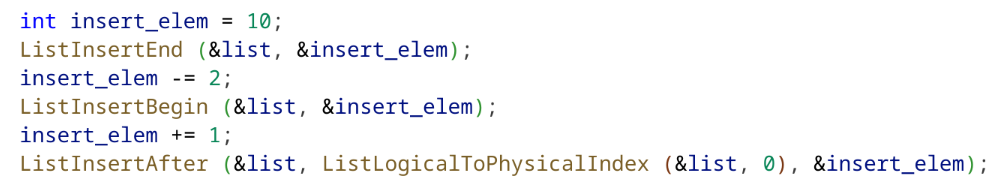
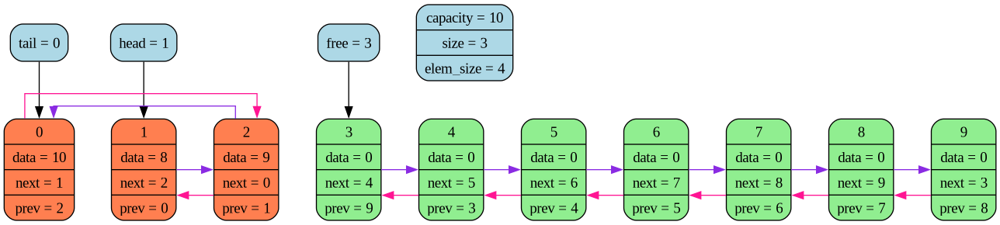
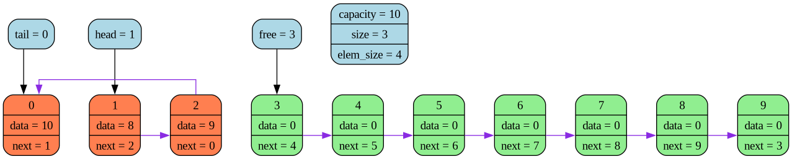

# Cписок с красивым дампом

## Компиляция и запуск

**Компиляция:**  

Двусвязный список:
`g++ -DDOUBLY_LINKED_LIST -I./include ./src/main.c ./src/LinkedList.c -o main`  

Односвязный список:
`g++ -I./include ./src/main.c ./src/LinkedList.c -o main`  

**Запуск:** `./main`  

## Описание

Реализован двусвязный и односвязный список (определяется флагом компиляции) на динамическом массиве.

Последний элемент списка указывает на первый, а первый на последний (кольцевой буфер, см. картинку с дампом).

Вставлять элементы можно в начало списка, в конец и после любого уже вставленного элемента. Все три варианта сводятся к вызову функции ListInsertAfter. Свести функцию ListInsertBegin к функции ListInsertAfter помогает то, что список также является кольцевым буфером, поэтому вставить элемент перед head равносильно тому, чтобы вставить его после tail.

С помощью функции ListLogicalToPhysicalIndex можно найти физический индекс элемента в массиве, указав его логический номер.

Список реализован на void*, но дамп только для типа int.

## Дамп

Дамп списка реализован через graphviz.

С помощью файла .dot сгенерированного функцией ListDump можно получить .png файл с красивой картинкой, используя команду:

```dot ./dump/dump.dot -Tpng -o ./dump/dump.png``` (для linux)

Подразумевается, что .dot файл находится в папке dump.

Пример использования списка (см. файл ./src/main.c):


Для кода сверху дамп будет выглядеть следующим образом

Двусвязный список:


Односвязный список:


Зеленым помечены незанятые элементы массива, head указывает на первый элемент в списке, tail на последний, free на первый свободный индекс массива, в который поместится следующий добавленный элемент.

